# Documentation Map

Visual map of all documentation showing hierarchy, relationships, and navigation flow.

---

## How to Read This Map

- **Boxes**: Documentation files or directories
- **Arrows**: Navigation flow (where docs reference each other)
- **Colors**:
  - 🟦 Blue: Entry points
  - 🟩 Green: Core guides (main workflow)
  - 🟨 Yellow: Reference guides (use as needed)
  - 🟧 Orange: Domain-specific guides

---

## Documentation Hierarchy

```plantuml
@startuml Documentation Map

' Entry Points
package "Entry Points" #LightBlue {
  [Project README\n../README.md] as ProjectREADME
  [Docs README\ndocs/README.md] as DocsREADME
}

' Main Implementation Area
package "Implementation Guides" #LightGreen {
  [Implementation README\nimplementation/README.md] as ImplREADME
  [Microservice Dev Guide v2\nmicroservice-development-guide-v2.md] as DevGuideV2
  [Microservice Dev Guide v1\nmicroservice-development-guide-v1.md] as DevGuideV1
}

' Configuration Guides
package "Configuration Management" #LightYellow {
  [Config README\nconfiguration-management/README.md] as ConfigREADME
  [Environment Config\nenvironment-configuration.md] as EnvConfig
  [Service Config\nservice-configuration.md] as ServiceConfig
  [Database Config\ndatabase-configuration.md] as DBConfig
  [API Config\napi-configuration.md] as APIConfig
  [Resources Config\nresources-configuration.md] as ResourcesConfig
  [Features Config\nfeatures-configuration.md] as FeaturesConfig
  [GitHub Config\ngithub-configuration.md] as GitHubConfig
  [AWS Config\naws-configuration.md] as AWSConfig
  [Environment Variables\nenvironment-variables.md] as EnvVars
}

' Endpoint Guides
package "Adding Endpoints" #LightCoral {
  [Part 1: Lambda Handlers\nadding-endpoints-part-1-lambda-handlers.md] as EndpointsPart1
  [Part 2: API Gateway\nadding-endpoints-part-2-api-gateway.md] as EndpointsPart2
}

' Database Guides
package "Database & Data Access" #LightSalmon {
  [Database Setup\ndatabase-setup.md] as DatabaseSetup
  [Data Access Layer\ndata-access.md] as DataAccess
}

' Testing Guides
package "Testing Guides" #Lavender {
  [Handler Testing\ntesting/handler-testing-guide.md] as HandlerTesting
  [CDK Template Testing\ntesting/cdk-template-testing-guide.md] as CDKTesting
  [Schema Testing\ntesting/schema-testing-guide.md] as SchemaTesting
  [Unit Helpers Testing\ntesting/unit-helpers-testing-guide.md] as HelpersTesting
  [E2E Testing\ntesting/e2e-testing-guide.md] as E2ETesting
}

' Other Implementation Guides
package "Other Implementation" #Wheat {
  [Deployment\ndeployment.md] as Deployment
  [Monitoring\nmonitoring.md] as Monitoring
  [Using Constructs\nusing-constructs.md] as UsingConstructs
  [Authentication\nauthentication.md] as Authentication
  [Authorization\nauthorization.md] as Authorization
}

' Navigation Flow - Entry Points
ProjectREADME --> DocsREADME : "Getting Started"
DocsREADME --> ImplREADME : "Main Entry"

' Navigation Flow - Main Workflow
ImplREADME --> DevGuideV2 : "Primary Workflow"
ImplREADME --> DevGuideV1 : "Alternative Workflow"

' Dev Guide References Configuration
DevGuideV2 --> ConfigREADME : "Step 1: Configure"
DevGuideV2 --> DatabaseSetup : "Step 2: Database"
DevGuideV2 --> EndpointsPart1 : "Step 3: Handlers"
DevGuideV2 --> EndpointsPart2 : "Step 4: API Gateway"
DevGuideV2 --> Deployment : "Step 5: Deploy"
DevGuideV2 --> Monitoring : "Step 6: Monitor"

' Configuration Hierarchy
ConfigREADME --> EnvConfig : "Environment Overrides"
ConfigREADME --> ServiceConfig : "Service Metadata"
ConfigREADME --> DBConfig : "Database Tables"
ConfigREADME --> APIConfig : "API Gateway"
ConfigREADME --> ResourcesConfig : "Resource Naming"
ConfigREADME --> FeaturesConfig : "Feature Toggles"
ConfigREADME --> GitHubConfig : "CI/CD"
ConfigREADME --> AWSConfig : "AWS Settings"
ImplREADME --> EnvVars : "Environment Variables"

' Endpoint Guides Flow
EndpointsPart1 --> EndpointsPart2 : "Next: API Gateway"
EndpointsPart1 --> HandlerTesting : "Testing"
EndpointsPart1 --> SchemaTesting : "Schema Validation"
EndpointsPart1 --> HelpersTesting : "Helper Functions"
EndpointsPart2 --> CDKTesting : "CDK Testing"

' Database Flow
DatabaseSetup --> DataAccess : "Data Operations"
DatabaseSetup --> DBConfig : "Configuration"

' Testing References
EndpointsPart1 --> HandlerTesting : "Handler Tests"
EndpointsPart2 --> CDKTesting : "CDK Tests"
DevGuideV2 --> E2ETesting : "E2E Tests"

' Cross-References
APIConfig --> EndpointsPart2 : "API Gateway Details"
DBConfig --> DatabaseSetup : "Database Details"
Authentication --> Authorization : "Related"
Monitoring --> Deployment : "Post-Deployment"

' Configuration Cross-References
ServiceConfig --> ResourcesConfig : "Uses Service Name"
DBConfig --> DataAccess : "Table Access"
EnvConfig --> EnvVars : "Environment Variables"

@enduml
```



---

## Documentation Categories

### 1. Entry Points (Start Here)

**Purpose**: Where developers begin their journey

- **[Project README](../README.md)** - Project setup and installation
- **[Docs README](./README.md)** - Documentation entry point

**When to use**: First time setup, getting oriented

---

### 2. Core Workflow Guides

**Purpose**: Main development workflow from start to finish

- **[Implementation README](./implementation/README.md)** - Overview of all implementation guides
- **[Microservice Development Guide v2](./implementation/microservice-development-guide-v2.md)** - Primary workflow (8 steps)
- **[Microservice Development Guide v1](./implementation/microservice-development-guide-v1.md)** - Alternative workflow

**When to use**: Building new features, following development process

**Flow**:

```
Step 1: Configure → Step 2: Database → Step 3: Handlers →
Step 4: API Gateway → Step 5: Deploy → Step 6: Monitor
```

---

### 3. Configuration Guides

**Purpose**: Configure service for different environments and domains

**Entry Point**: [Configuration Management README](./implementation/configuration-management/README.md)

**Domain Guides**:

- [Environment Configuration](./implementation/configuration-management/environment-configuration.md) - Local, staging, production
- [Service Configuration](./implementation/configuration-management/service-configuration.md) - Service metadata
- [Database Configuration](./implementation/configuration-management/database-configuration.md) - DynamoDB tables
- [API Configuration](./implementation/configuration-management/api-configuration.md) - API Gateway settings
- [Resources Configuration](./implementation/configuration-management/resources-configuration.md) - Resource naming
- [Features Configuration](./implementation/configuration-management/features-configuration.md) - Feature toggles
- [GitHub Configuration](./implementation/configuration-management/github-configuration.md) - CI/CD setup
- [AWS Configuration](./implementation/configuration-management/aws-configuration.md) - AWS settings

**Related**: [Environment Variables](./implementation/environment-variables.md)

**When to use**:

- Initial setup (Step 1 of workflow)
- Changing configuration
- Adding new config domains
- Troubleshooting config issues

---

### 4. Endpoint Development Guides

**Purpose**: Add new API endpoints (Lambda + API Gateway)

**Guides**:

- **[Part 1: Lambda Handlers](./implementation/adding-endpoints-part-1-lambda-handlers.md)** - Business logic, validation, helpers
- **[Part 2: API Gateway Integration](./implementation/adding-endpoints-part-2-api-gateway.md)** - REST API, CORS, authorization

**When to use**:

- Adding new endpoints (Step 3-4 of workflow)
- Modifying existing endpoints
- Understanding handler patterns

**Flow**: Part 1 (Handlers) → Part 2 (API Gateway) → Testing

---

### 5. Database & Data Access Guides

**Purpose**: Set up DynamoDB tables and data access patterns

**Guides**:

- **[Database Setup](./implementation/database-setup.md)** - Table configuration, Faux-SQL vs Single-Table
- **[Data Access Layer](./implementation/data-access.md)** - DynamoDB operations, transforms

**When to use**:

- Defining tables (Step 2 of workflow)
- Adding new tables
- Implementing data access patterns

**Flow**: Database Setup → Data Access Layer → Database Config

---

### 6. Testing Guides

**Purpose**: Test your code at different levels

**Guides**:

- **[Handler Testing](./testing/handler-testing-guide.md)** - Test Lambda handlers with mocks
- **[CDK Template Testing](./testing/cdk-template-testing-guide.md)** - Test infrastructure
- **[Schema Testing](./testing/schema-testing-guide.md)** - Test Zod validation schemas
- **[Unit Helpers Testing](./testing/unit-helpers-testing-guide.md)** - Test pure functions
- **[E2E Testing](./testing/e2e-testing-guide.md)** - Test deployed API

**When to use**:

- After implementing handlers (Part 1)
- After implementing API Gateway (Part 2)
- Before deployment
- During development (TDD)

**Flow**: Unit Tests → Handler Tests → CDK Tests → E2E Tests

---

### 7. Deployment & Operations Guides

**Purpose**: Deploy and monitor your service

**Guides**:

- **[Deployment](./implementation/deployment.md)** - CDK deployment process
- **[Monitoring](./implementation/monitoring.md)** - CloudWatch, alarms, SNS

**When to use**:

- Deploying to AWS (Step 5 of workflow)
- Setting up monitoring (Step 6 of workflow)
- Troubleshooting production issues

---

### 8. Reference Guides

**Purpose**: Deep dives into specific topics

**Guides**:

- **[Using Constructs](./implementation/using-constructs.md)** - CDK construct patterns
- **[Authentication](./implementation/authentication.md)** - Cognito setup
- **[Authorization](./implementation/authorization.md)** - OAuth scopes, permissions

**When to use**: As needed for specific topics

---

## Common Navigation Paths

### Path 1: New Developer Setup

```
Project README → Docs README → Implementation README →
Dev Guide v2 (Step 1: Configure) → Configuration README
```

### Path 2: Adding New Endpoint

```
Dev Guide v2 (Step 3-4) → Part 1: Lambda Handlers →
Part 2: API Gateway → Handler Testing → CDK Testing
```

### Path 3: Configuring Service

```
Configuration README → Choose domain guide →
Environment Variables (if needed)
```

### Path 4: Setting Up Database

```
Dev Guide v2 (Step 2) → Database Setup →
Database Config → Data Access Layer
```

### Path 5: Deploying & Monitoring

```
Dev Guide v2 (Step 5-6) → Deployment → Monitoring
```

---

## Quick Reference

### By Task

| Task              | Start Here                                                                             |
| ----------------- | -------------------------------------------------------------------------------------- |
| First time setup  | [Project README](../README.md)                                                         |
| Add new endpoint  | [Part 1: Lambda Handlers](./implementation/adding-endpoints-part-1-lambda-handlers.md) |
| Configure service | [Configuration README](./implementation/configuration-management/README.md)            |
| Set up database   | [Database Setup](./implementation/database-setup.md)                                   |
| Write tests       | [Handler Testing](./testing/handler-testing-guide.md)                                  |
| Deploy to AWS     | [Deployment](./implementation/deployment.md)                                           |
| Add monitoring    | [Monitoring](./implementation/monitoring.md)                                           |

### By Role

| Role              | Start Here                                                                                         |
| ----------------- | -------------------------------------------------------------------------------------------------- |
| New Developer     | [Docs README](./README.md) → [Dev Guide v2](./implementation/microservice-development-guide-v2.md) |
| Backend Developer | [Part 1: Lambda Handlers](./implementation/adding-endpoints-part-1-lambda-handlers.md)             |
| DevOps Engineer   | [Deployment](./implementation/deployment.md) → [Monitoring](./implementation/monitoring.md)        |
| QA Engineer       | [Testing Guides](./testing/handler-testing-guide.md)                                               |

---

## Documentation Maintenance

### Adding New Documentation

1. Create the new guide
2. Add it to the appropriate package in the PlantUML diagram
3. Add navigation arrows showing relationships
4. Update this README with the new guide
5. Update related guides with cross-references

### Updating Existing Documentation

1. Update the guide content
2. Check if relationships changed (update diagram if needed)
3. Update cross-references in related guides
4. Update this map if categorization changed

---

## Diagram Source

The PlantUML diagram source is embedded in this file. To regenerate:

1. Copy the PlantUML code block
2. Use PlantUML online editor or local tool
3. Export as PNG/SVG
4. Embed in documentation if needed

**PlantUML Online Editor**: http://www.plantuml.com/plantuml/uml/

---

## Need Help?

- **Can't find a guide?** Check the [Quick Reference](#quick-reference) above
- **Not sure where to start?** Follow a [Common Navigation Path](#common-navigation-paths)
- **Documentation unclear?** Open an issue or submit a PR
